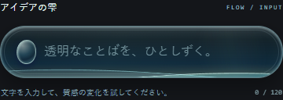
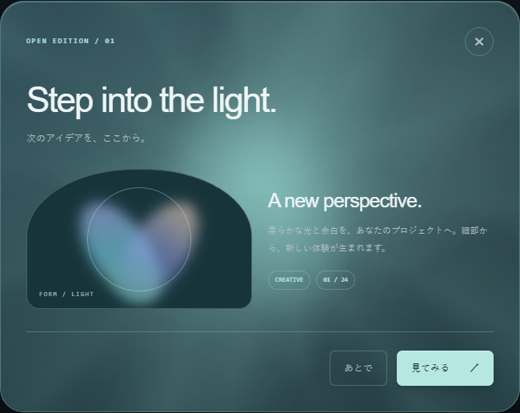
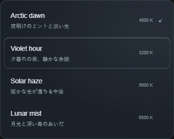

# ホバー進入・解除時の装飾の跳びを修正

模様や光が、通常の位置からホバー位置へ、また通常の位置へ戻る際に連続して動くよう修正しました。展示・詳細プレビュー・書き出し用コードが共有する実装に反映しています。

|対象|確認した原因と修正|
|---|---|
|Copper Plate / Iridescent Surface|CSSの通常角度とコントローラーの中央角度が違い、最初のホバーで角度が変わっていた。各素材の通常角度を起点に追従するよう変更。|
|Inlaid Surface / Plotted Surface / Scalloped Folio / Kiln Surface|遷移がホバー時だけ設定され、解除時に消えていた。子要素・疑似要素を含め、通常状態に遷移を設定。|
|Prismatic Edge|光の位置は補間されていたが、ホバーの影には遷移がなかった。影にも遷移を設定。|
|Dipped Label Link / Scored Edge Link|同様に解除時の遷移が消えていた。通常状態に遷移を設定。|
|共有の入力欄・ダイアログ・プルダウンの光|ポインター位置や通常位置を即時代入していた。描画座標を補間し、復帰中の再進入も現在の位置から継続。|
|表示直後のパネル|非同期の可視性判定が追いつかない場合、最初の追従が即時描画になっていた。実際に表示された矩形を確認して補間する。画面外の装飾は静止を維持。|

確認済み:

- 実Edgeの展示で、素材の通常角度、初回中央ホバー、柄と光の復帰途中・静止後を確認。8種類のブロックの追従、追加の柄2種類、リンク2種類を検証。
- 単独の実Vanillaプレビューで、入力欄・ダイアログ・プルダウンの進入、解除、復帰中の再進入、モーション低減、入力値・選択値の維持を検証。
- 実React StrictModeで、TSXのportable書き出しとJSXのoriginal書き出しについて、同じ3部品の追従・復帰・アンマウントを確認。
- 既存の入力欄テスト17項目、選択・スライダー・ダイアログのテスト18項目、プルダウン等のテスト12項目が成功。IME、読み取り専用、キーボード、フォーム、フォーカス、狭い画面、後片付けを確認。
- 関連のユニットテスト16件、アプリ・React・ツールの型検査、CIへのテスト割当チェックが成功。
- 本番ビルド成功。対象12部品の生成済みプレビューと、4形式×2配置の全96通りのコード・プロンプトが修正後のソースと一致。

`test:surface-motion` に進入・復帰と実React書き出しの回帰確認を追加しました。既存のCIでも実行されます。

使用したUI-evolveスキルの既存の復帰に関する知見にも、通常状態への遷移定義、作者の通常角度の維持、表示直後の可視性の確認を追記しました。差分・ハッシュを履歴に保存し、構造検証に成功しています。

## 参考画像

静止画は修正後のホバー状態です。動きの連続性は上記ブラウザテストで途中値を測定しています。

このディレクトリは確認資料と参考画像のみです。実装とテストは src / tests にあります。
