# STATE OF PLAY 類似パーツ調査

2026-10-06 / HEAD 84472086

[写真を並べた比較レポート](index.html)

調査817件（37カテゴリ）、Liquid Glass70件を除外。通常写真817枚を全件比較。類似61組（153パーツ）、削除提案92件（高67件・中25件）。実際の削除は行っていません。

「高」は統合推奨、「中」は素材・用途の差を残すなら保留可能です。色・背景を同じ系列のバリエーションとして扱う前提の提案を含みます。機能差があることだけを理由に削除したり、静止画だけで動きを同一視したりしないよう、開閉・選択表示と実装も確認しました。

静止画のアニメーションは撮影時に固定されています。動きの名前・速度はstates.json、元コードは各パーツのbaseパスを参照してください。ツールやスケルトンなどの挙動差は統合時に再検証が必要です。削除候補はデザイン判断であり、参照関係・公開APIへの影響確認は今回の範囲外です。

## 比較と提案

### G01 ローダー / 優先度高

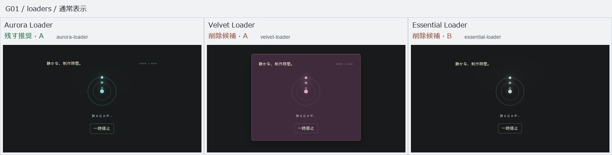

- 似ているところ：三重の同心円、円周上の点、中央の脈動が同じ。
- 異なるところ：Auroraは青緑、Velvetは紫の外枠、Essentialは控えめな配色。
- 残す：Aurora Loader (aurora-loader)
- 削除候補：Velvet Loader (velvet-loader)、Essential Loader (essential-loader)
- 理由：形と回転・脈動の仕組みが重複。背景や色は残す代表の設定で扱える。

### G02 ローダー / 優先度高

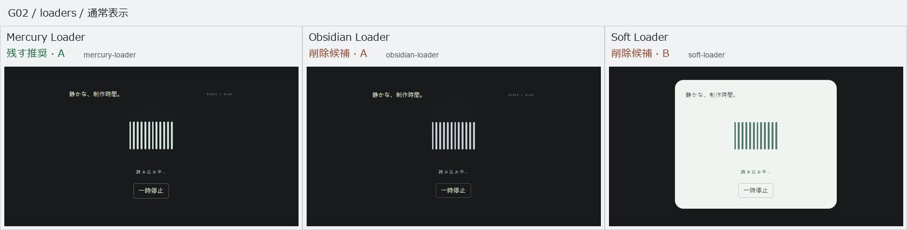

- 似ているところ：12本の縦棒を時間差で伸縮させる同じローダー。
- 異なるところ：Mercuryは金属色、Obsidianは暗色、Softは白い外枠。
- 残す：Mercury Loader (mercury-loader)
- 削除候補：Obsidian Loader (obsidian-loader)、Soft Loader (soft-loader)
- 理由：色と外枠を除くと同じ波形。同じ棒型を3件残す必要性が低い。

### G03 ローダー / 優先度高

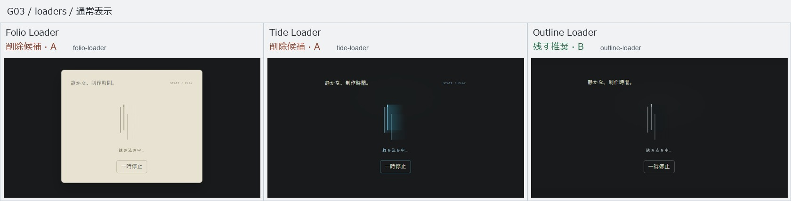

- 似ているところ：3枚の細い板がずれて揺れる振り子型。
- 異なるところ：Folioは紙の背景、Tideは青い面、Outlineは背景を省く。
- 残す：Outline Loader (outline-loader)
- 削除候補：Folio Loader (folio-loader)、Tide Loader (tide-loader)
- 理由：同じ揺れを素材色で増やした系列。背景を要求しないOutlineを代表にする。

### G04 ローダー / 優先度高

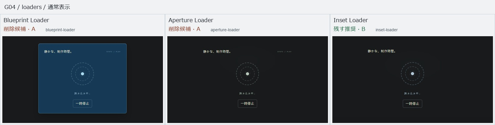

- 似ているところ：破線の三重円と中心の点が回転する構成。
- 異なるところ：Blueprintは青い外枠、Apertureは灰色、Insetは青灰色。
- 残す：Inset Loader (inset-loader)
- 削除候補：Blueprint Loader (blueprint-loader)、Aperture Loader (aperture-loader)
- 理由：名称から期待される製図・開口の違いが、現在の形と回転にはほぼ出ていない。

### G05 ローダー / 優先度高

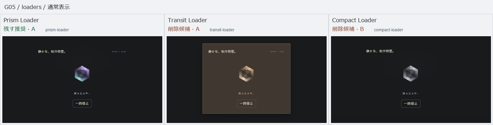

- 似ているところ：立体的な中空六角形を回す構成。
- 異なるところ：紫・茶・灰の配色と外枠、わずかな大きさが違う。
- 残す：Prism Loader (prism-loader)
- 削除候補：Transit Loader (transit-loader)、Compact Loader (compact-loader)
- 理由：プリズムの代表1件へ集約し、色違いだけのTransit/Compactを外す。

### G06 ローダー / 優先度高

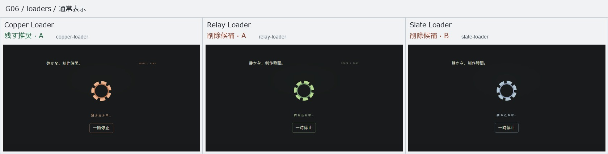

- 似ているところ：8分割された円環の同じ回転。
- 異なるところ：銅色・緑・青灰色。
- 残す：Copper Loader (copper-loader)
- 削除候補：Relay Loader (relay-loader)、Slate Loader (slate-loader)
- 理由：円環の分割数と回転方式が同じ。Copperの素材色が最も名前と対応する。

### G07 ローダー / 優先度高

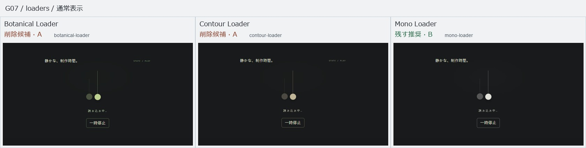

- 似ているところ：2本の糸と球を左右へ振る構成。
- 異なるところ：球の色と糸の色が違う。
- 残す：Mono Loader (mono-loader)
- 削除候補：Botanical Loader (botanical-loader)、Contour Loader (contour-loader)
- 理由：植物や等高線という独自表現になっておらず、Monoが素直な代表になる。

### G08 カード / 優先度高

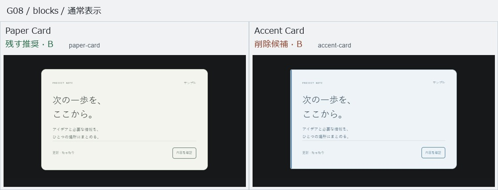

- 似ているところ：見出し・本文・区切り線・右下ボタンを置く同じ角丸カード。
- 異なるところ：Paperは暖かい白、Accentは青白い面と青い境界。
- 残す：Paper Card (paper-card)
- 削除候補：Accent Card (accent-card)
- 理由：情報構成・反応は同じで、Accentの独立した形の違いが弱い。

### G09 カード / 優先度中

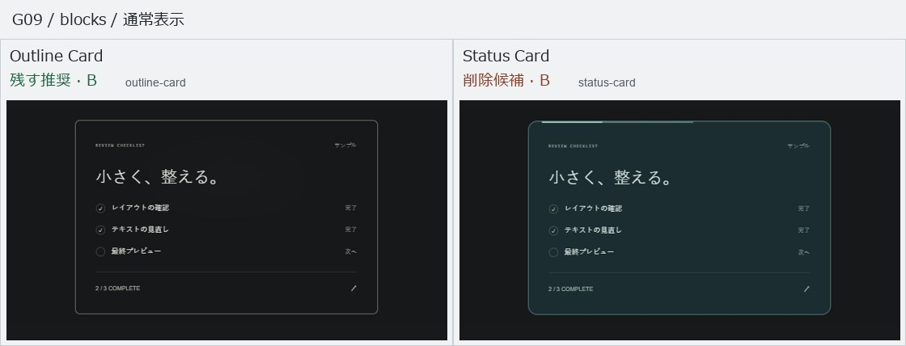

- 似ているところ：同じ3行チェックリストと下部の完了表示。
- 異なるところ：Statusは青緑の塗り面と上辺のアクセント、Outlineは薄い輪郭。
- 残す：Outline Card (outline-card)
- 削除候補：Status Card (status-card)
- 理由：状態表示を色以外で作り分けていないため、輪郭版を代表にする。

### G10 スクロールバー / 優先度中

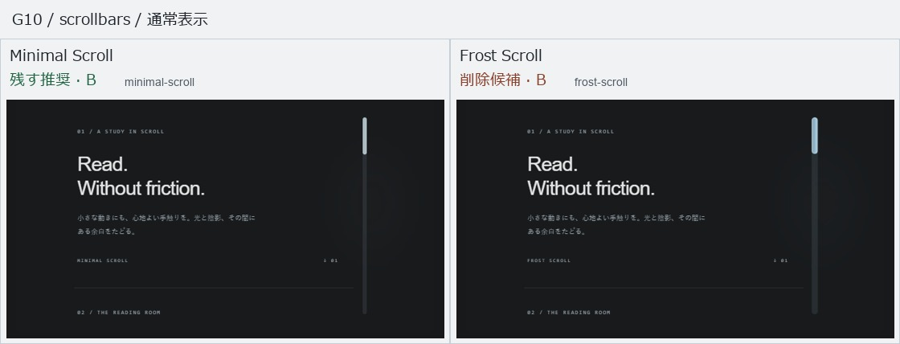

- 似ているところ：細い直線レールと角丸の明るいつまみ。
- 異なるところ：Frostは青い反射と軽い影、Minimalは単純な明色。
- 残す：Minimal Scroll (minimal-scroll)
- 削除候補：Frost Scroll (frost-scroll)
- 理由：スクロール時も同じ移動。Frostの差は小さな光沢に留まる。

### G11 スクロールバー / 優先度中

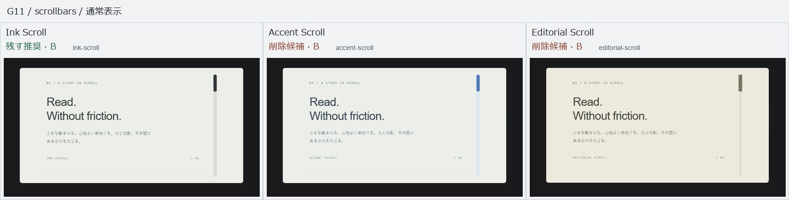

- 似ているところ：白い背景の細い直線レールと単色のつまみ。
- 異なるところ：黒・青・茶のつまみと背景の色温度が違う。
- 残す：Ink Scroll (ink-scroll)
- 削除候補：Accent Scroll (accent-scroll)、Editorial Scroll (editorial-scroll)
- 理由：形とスクロールの反応が同じ。配色を独立パーツ数に数えない方針なら集約できる。

### G12 ボタン / 優先度中

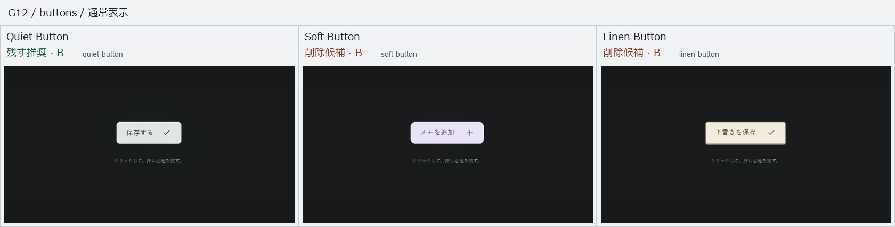

- 似ているところ：短い文字と右側の小アイコンを置く、塗り面の小ボタン。
- 異なるところ：色、角丸、Linenの弱い影と字体が違う。
- 残す：Quiet Button (quiet-button)
- 削除候補：Soft Button (soft-button)、Linen Button (linen-button)
- 理由：押下の構造と用途が重なる。Quietを基準に色・字体の設定として扱う。

### G13 リンク / 優先度高

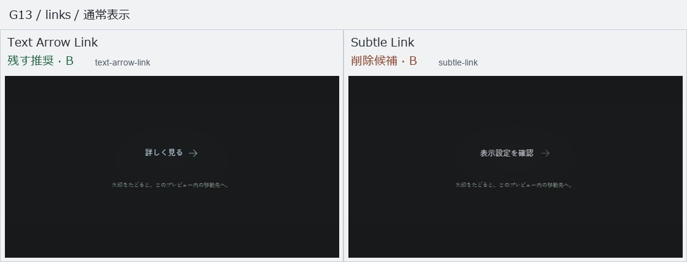

- 似ているところ：文字の右に矢印を置き、ホバーで右へずらすリンク。
- 異なるところ：色、矢印の大きさ、初期の不透明度が違う。
- 残す：Text Arrow Link (text-arrow-link)
- 削除候補：Subtle Link (subtle-link)
- 理由：同じ構成とホバー。Text Arrowの分かりやすい表示を残す。

### G14 タブ / 優先度中

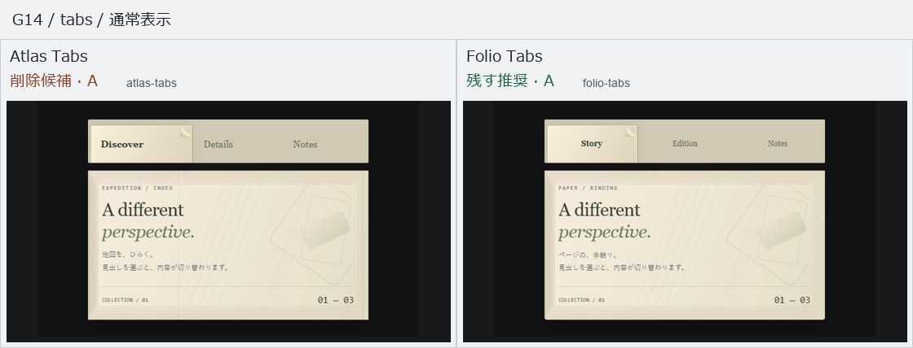

- 似ているところ：紙色の3タブ、折れた選択片、紙の層を持つ本文。
- 異なるところ：ラベル、端の切り欠き、個別CSSの設定値に差がある。
- 残す：Folio Tabs (folio-tabs)
- 削除候補：Atlas Tabs (atlas-tabs)
- 理由：実表示の共通paper/map演出が強く、地図と綴じ本の違いが弱い。紙という名前が明確なFolioを残す。

### G15 タブ / 優先度高

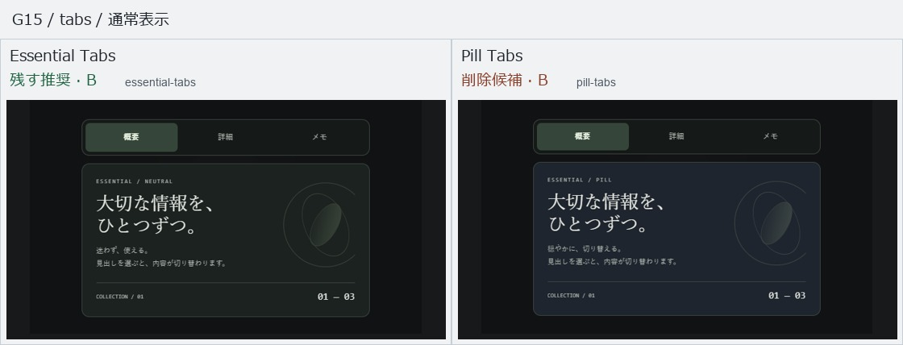

- 似ているところ：角丸レール上を選択面が滑り、同じ構成の本文を切り替える。
- 異なるところ：本文面の色と角丸の程度が違う。
- 残す：Essential Tabs (essential-tabs)
- 削除候補：Pill Tabs (pill-tabs)
- 理由：Pillという名前ほど選択部の輪郭が違わず、独立した用途も重なる。

### G16 セグメント / 優先度高

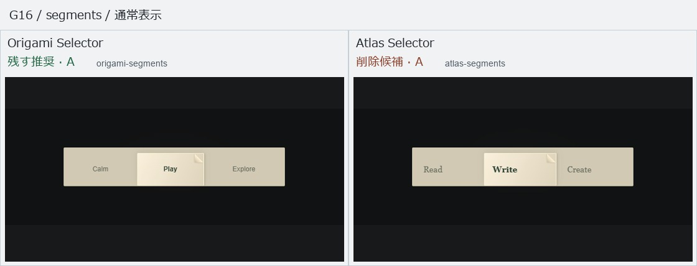

- 似ているところ：紙色の横並び3択と、角の折れた選択面。
- 異なるところ：初期の文字と、個別CSSで指定する切り欠きが違う。
- 残す：Origami Selector (origami-segments)
- 削除候補：Atlas Selector (atlas-segments)
- 理由：実表示では同じ紙の折れと移動が中心。折り紙という表現を明示するOrigamiを残す。

### G17 セグメント / 優先度中

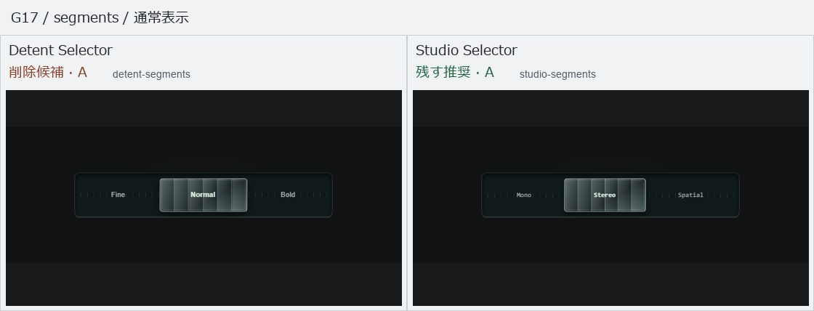

- 似ているところ：暗いレールと分割された金属の選択面。
- 異なるところ：Detentは少数の太い縦面、Studioは細い縦面が多い。
- 残す：Studio Selector (studio-segments)
- 削除候補：Detent Selector (detent-segments)
- 理由：同じ板の回転と移動。刻みの密度だけでは2件分の個性が弱い。

### G18 セグメント / 優先度高

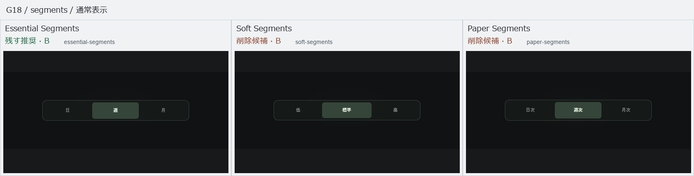

- 似ているところ：暗い角丸レールと緑の選択面が同じ3択。
- 異なるところ：初期ラベル、余白と角丸の微差。Paperも現行表示は紙色にならない。
- 残す：Essential Segments (essential-segments)
- 削除候補：Soft Segments (soft-segments)、Paper Segments (paper-segments)
- 理由：見た目と切り替えが非常に近い。想定CSSではなく現行実表示を基準に集約する。

### G19 セグメント / 優先度高

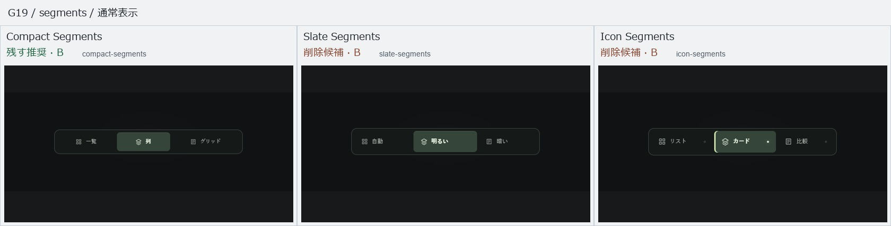

- 似ているところ：アイコン付きの暗い3択レール。
- 異なるところ：Iconは輪郭・点、ラベルと細かな余白が違う。
- 残す：Compact Segments (compact-segments)
- 削除候補：Slate Segments (slate-segments)、Icon Segments (icon-segments)
- 理由：同じ配置と選択面の移動。アイコン対応をCompactのオプションとして残せる。

### G20 チェックボックス / 優先度高

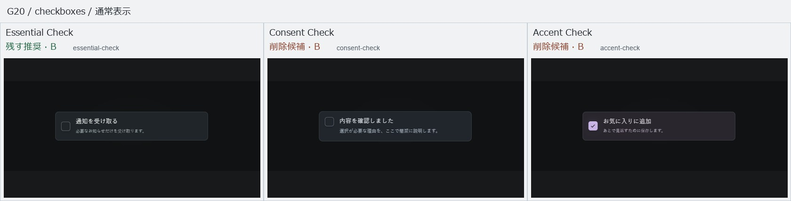

- 似ているところ：四角いチェックと2行の説明を同じ角丸の帯に配置。
- 異なるところ：文言、配色、選択済み状態が違う。
- 残す：Essential Check (essential-check)
- 削除候補：Consent Check (consent-check)、Accent Check (accent-check)
- 理由：同じチェック操作と形。Consent/Accentの違いは接続先や配色で表せる。

### G21 ダイアログ / 優先度中

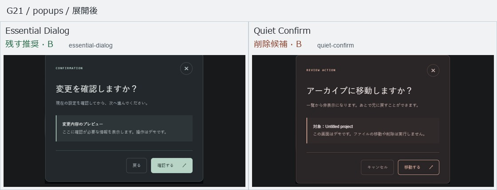

- 似ているところ：閉じるボタン・見出し・説明・確認内容・下部操作の確認ダイアログ。
- 異なるところ：初期内容と面の色が違う。
- 残す：Essential Dialog (essential-dialog)
- 削除候補：Quiet Confirm (quiet-confirm)
- 理由：確認対象を変えたデモに近く、Quiet専用のレイアウトが弱い。

### G22 ダイアログ / 優先度中

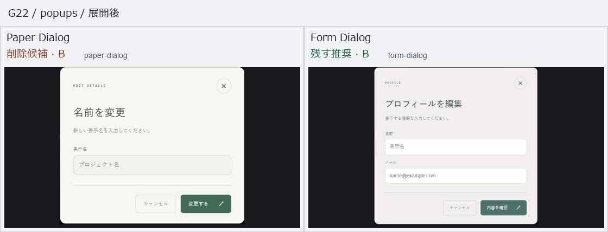

- 似ているところ：白い編集ダイアログに入力欄と下部の操作を配置。
- 異なるところ：項目数、余白、見出しの字体と初期ラベルが違う。
- 残す：Form Dialog (form-dialog)
- 削除候補：Paper Dialog (paper-dialog)
- 理由：名前変更とプロフィール編集は本体に渡す内容の違い。Formが汎用的な代表。

### G23 スライダー / 優先度高

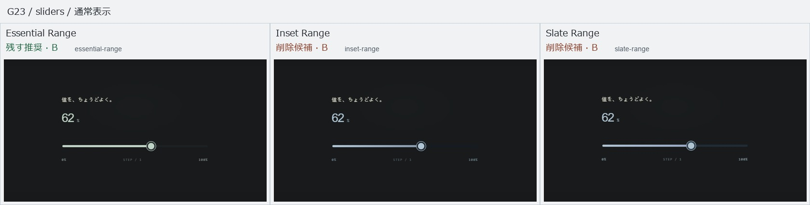

- 似ているところ：値・一本の線・丸いつまみの単値スライダー。
- 異なるところ：青灰色の色調と輪郭の微差。
- 残す：Essential Range (essential-range)
- 削除候補：Inset Range (inset-range)、Slate Range (slate-range)
- 理由：値の操作とレールの構造が同じ。Inset/Slateの固有機構がない。

### G24 スライダー / 優先度高

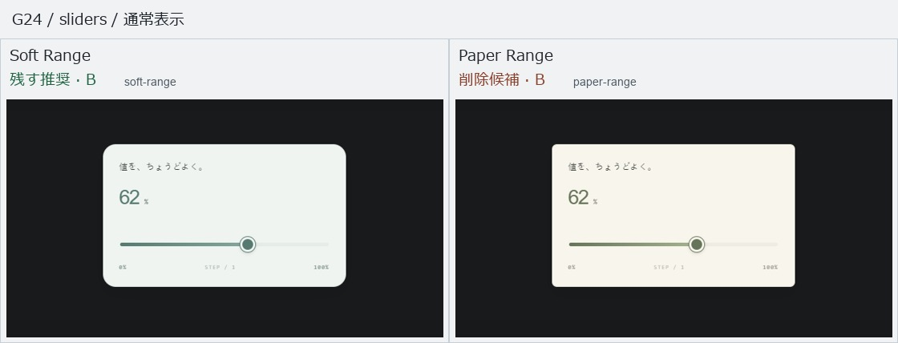

- 似ているところ：明るい外枠の中に同じ単値スライダー。
- 異なるところ：緑白と生成り、角丸と字体。
- 残す：Soft Range (soft-range)
- 削除候補：Paper Range (paper-range)
- 理由：明色の基本形は1件にまとめ、紙色はテーマ設定として残せる。

### G25 スライダー / 優先度高

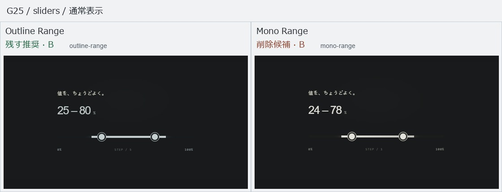

- 似ているところ：2つの丸いつまみで範囲を指定する細いレール。
- 異なるところ：初期値と配色が違う。
- 残す：Outline Range (outline-range)
- 削除候補：Mono Range (mono-range)
- 理由：共通APIで範囲値を設定でき、形も操作もほぼ同じ。

### G26 ラジオ / 優先度高

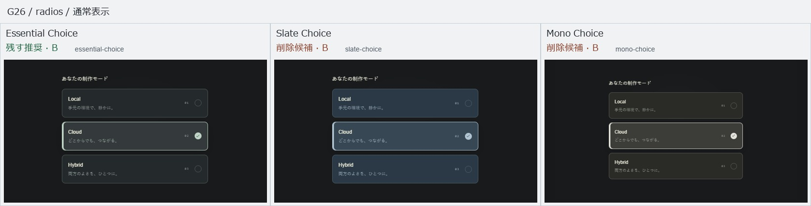

- 似ているところ：3枚の選択カード、右端の丸い指標と選択枠。
- 異なるところ：青灰色・茶色の配色、角丸の微差。
- 残す：Essential Choice (essential-choice)
- 削除候補：Slate Choice (slate-choice)、Mono Choice (mono-choice)
- 理由：同じレイアウトと選択操作。色違いの独立登録を減らす。

### G27 ラジオ / 優先度高

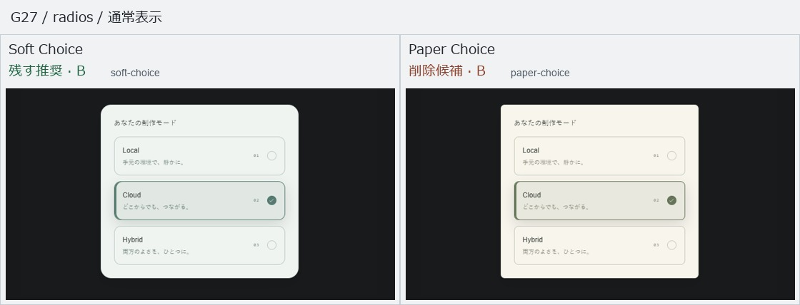

- 似ているところ：明るい外枠と3枚の選択カード。
- 異なるところ：生成りの色と字体、角丸。
- 残す：Soft Choice (soft-choice)
- 削除候補：Paper Choice (paper-choice)
- 理由：構成も選択の見せ方も同じ。Softを明色の代表にする。

### G28 コンボボックス / 優先度高

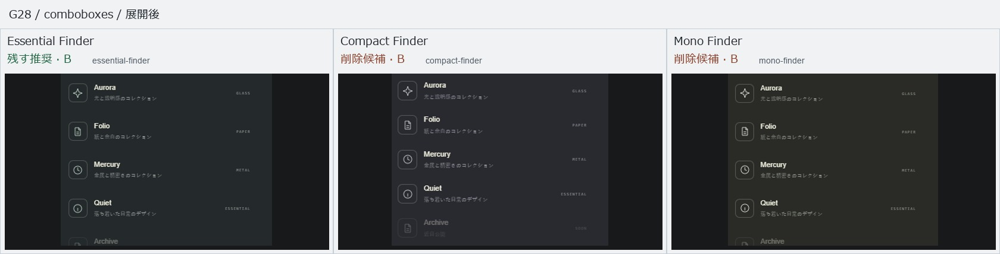

- 似ているところ：左の検索記号、入力、右の展開ボタンを持つ横長フィールド。
- 異なるところ：配色と小さな角丸・文字サイズ。
- 残す：Essential Finder (essential-finder)
- 削除候補：Compact Finder (compact-finder)、Mono Finder (mono-finder)
- 理由：候補一覧も同じ構成。Compactは独立したコンパクトレイアウトの差が弱い。

### G29 コンボボックス / 優先度高

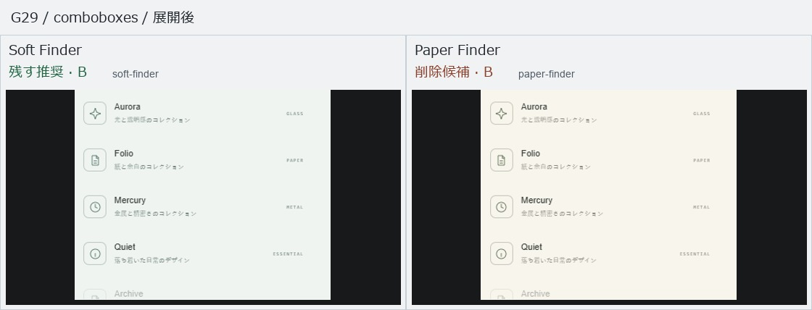

- 似ているところ：明るい外枠と同じ検索・候補欄。
- 異なるところ：生成りの色と字体、角丸。
- 残す：Soft Finder (soft-finder)
- 削除候補：Paper Finder (paper-finder)
- 理由：入力と候補表示が重なり、Paperの差はテーマ相当。

### G30 コンボボックス / 優先度中

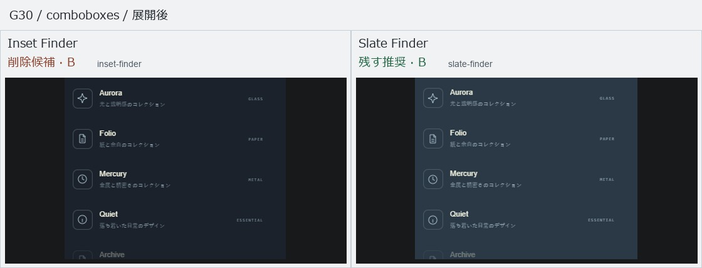

- 似ているところ：青いフィールドに検索と展開操作を置く。
- 異なるところ：Insetは角ばった枠、Slateは少し丸い塗り面。
- 残す：Slate Finder (slate-finder)
- 削除候補：Inset Finder (inset-finder)
- 理由：展開後も構成は同じ。Insetの沈み込みが独立した特徴になりにくい。

### G31 通知 / 優先度高

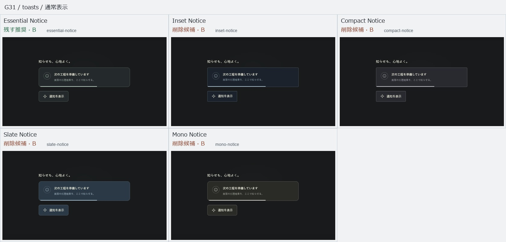

- 似ているところ：同じ説明記号、2行の文章、下端の時間表示を持つ通知。
- 異なるところ：色、角丸、数pxの文字・余白の差。
- 残す：Essential Notice (essential-notice)
- 削除候補：Inset Notice (inset-notice)、Compact Notice (compact-notice)、Slate Notice (slate-notice)、Mono Notice (mono-notice)
- 理由：表示・退出・操作の構造が同じで、5件分の選択肢としては過密。

### G32 通知 / 優先度高

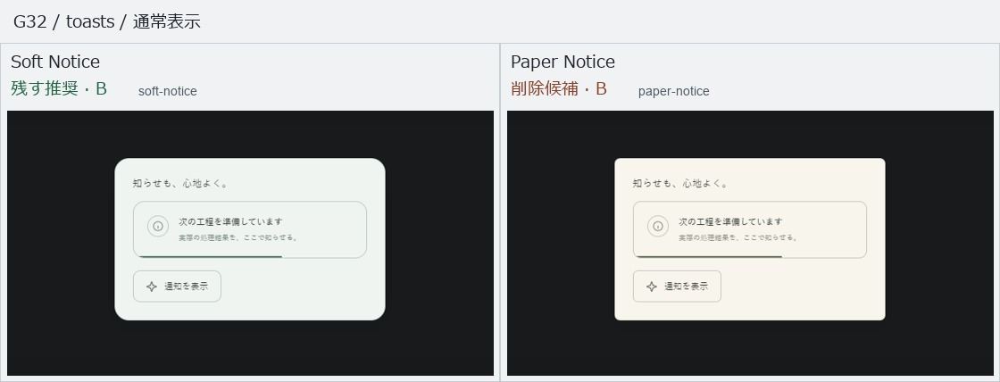

- 似ているところ：明るい外枠に同じ通知と表示ボタン。
- 異なるところ：生成りと緑白、角丸と字体。
- 残す：Soft Notice (soft-notice)
- 削除候補：Paper Notice (paper-notice)
- 理由：同じ通知をテーマ変更した系列としてまとめられる。

### G33 ポップオーバー / 優先度高

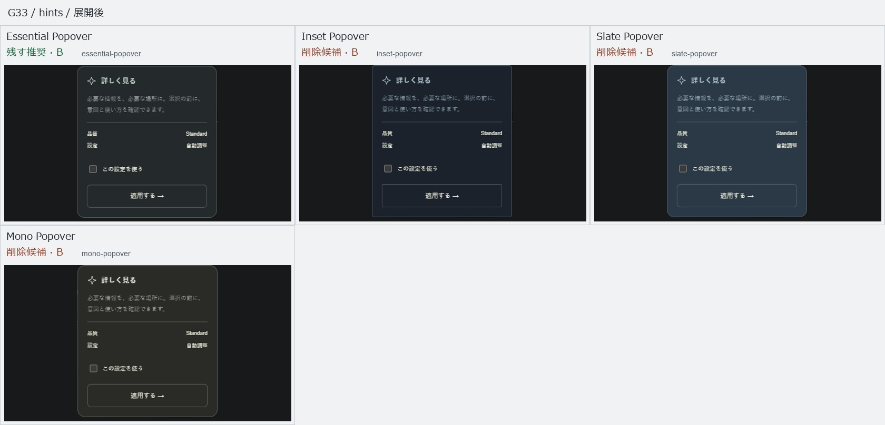

- 似ているところ：同じ小さなトリガーと説明パネル。
- 異なるところ：トリガー・面の配色と角丸。
- 残す：Essential Popover (essential-popover)
- 削除候補：Inset Popover (inset-popover)、Slate Popover (slate-popover)、Mono Popover (mono-popover)
- 理由：説明表示の構造が重なる。透明なOutlineや密度を変えるCompactは別途残す。

### G34 進捗 / 優先度高

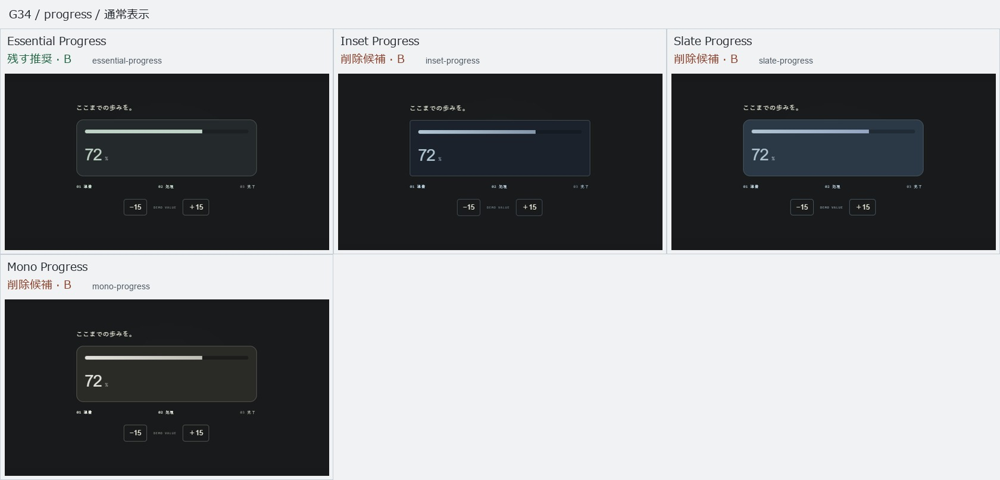

- 似ているところ：横棒と数値を持つ進捗表示。
- 異なるところ：色と外枠の角丸、細い輪郭。
- 残す：Essential Progress (essential-progress)
- 削除候補：Inset Progress (inset-progress)、Slate Progress (slate-progress)、Mono Progress (mono-progress)
- 理由：進捗を更新したときの構造が同じ。円形のOutlineは別の表現なので残す。

### G35 進捗 / 優先度高

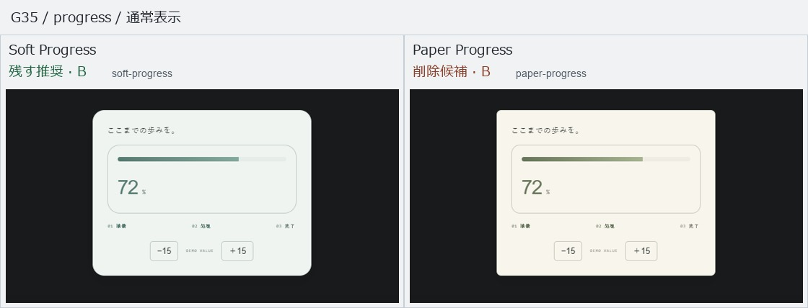

- 似ているところ：明るい外枠の横棒・数値表示。
- 異なるところ：生成りの色と字体、角丸。
- 残す：Soft Progress (soft-progress)
- 削除候補：Paper Progress (paper-progress)
- 理由：同じ進捗表示の明色版を1件に集約できる。

### G36 アップロード / 優先度高

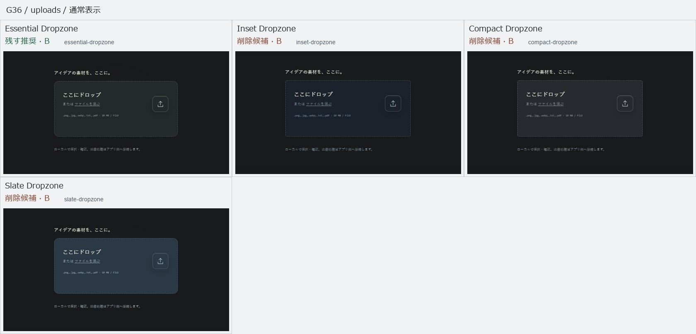

- 似ているところ：点線のドロップ領域、説明、右端の選択ボタン。
- 異なるところ：色、角丸、微細な余白。
- 残す：Essential Dropzone (essential-dropzone)
- 削除候補：Inset Dropzone (inset-dropzone)、Compact Dropzone (compact-dropzone)、Slate Dropzone (slate-dropzone)
- 理由：ファイル選択後も同じ一覧。独自の投入機構や配置の違いがない。

### G37 アップロード / 優先度高

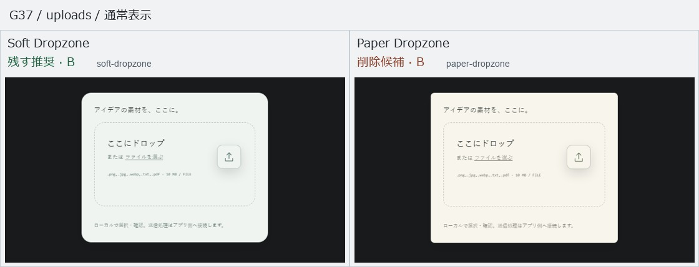

- 似ているところ：明るい外枠と同じ点線の投入領域。
- 異なるところ：生成りの色、角丸、字体。
- 残す：Soft Dropzone (soft-dropzone)
- 削除候補：Paper Dropzone (paper-dropzone)
- 理由：同じ投入・選択処理と配置で、テーマ差の域。

### G38 日時入力 / 優先度中

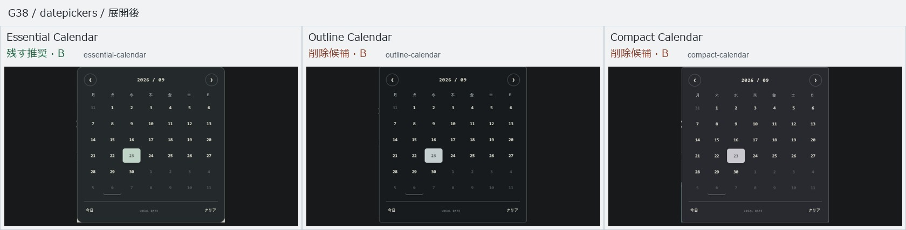

- 似ているところ：日付欄と右のカレンダーボタン。
- 異なるところ：角丸、境界と配色、初期の値。
- 残す：Essential Calendar (essential-calendar)
- 削除候補：Outline Calendar (outline-calendar)、Compact Calendar (compact-calendar)
- 理由：単日カレンダーを開いた後も構成が近く、3件の差が弱い。期間・日時・時刻の代表は残す。

### G39 ページ送り / 優先度高

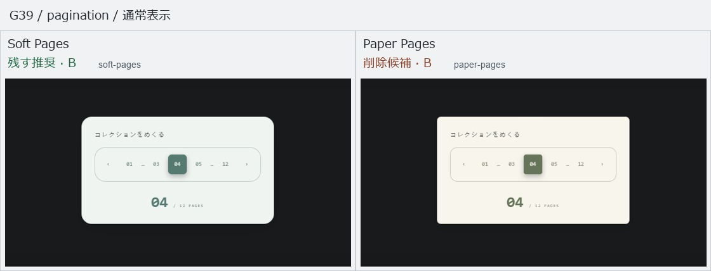

- 似ているところ：明るい外枠、番号列、現在ページの数値。
- 異なるところ：色温度・角丸・字体。
- 残す：Soft Pages (soft-pages)
- 削除候補：Paper Pages (paper-pages)
- 理由：同じページ送りと同じ移動面。明色の代表にまとめる。

### G40 ページ送り / 優先度高

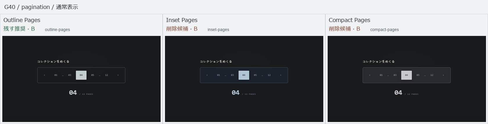

- 似ているところ：暗い横長の番号列と、その下の現在ページ表示。
- 異なるところ：枠内の塗り色、微細なサイズと字体。
- 残す：Outline Pages (outline-pages)
- 削除候補：Inset Pages (inset-pages)、Compact Pages (compact-pages)
- 理由：番号配置とページ変更が同じ。塗り面を抑えたOutlineを残す。

### G41 パンくず / 優先度高

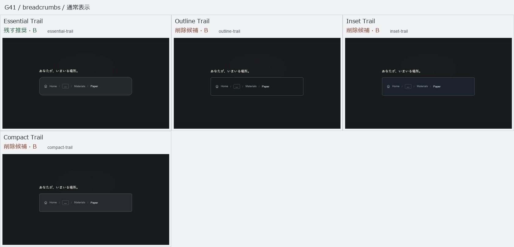

- 似ているところ：Home・省略・階層・現在地を横一列に置くパンくず。
- 異なるところ：色、角丸、微細な枠と文字サイズ。
- 残す：Essential Trail (essential-trail)
- 削除候補：Outline Trail (outline-trail)、Inset Trail (inset-trail)、Compact Trail (compact-trail)
- 理由：同じ経路と省略メニューを表示する。種類を分けるほどの配置差が弱い。

### G42 パンくず / 優先度高

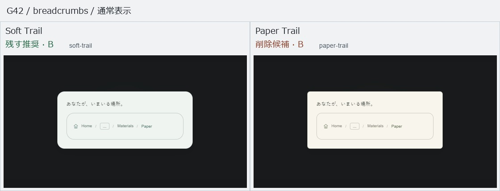

- 似ているところ：明るい外枠の同じ横並びパンくず。
- 異なるところ：色温度・角丸・字体。
- 残す：Soft Trail (soft-trail)
- 削除候補：Paper Trail (paper-trail)
- 理由：明色テーマ違いとしてまとめられる。

### G43 タグ / 優先度高

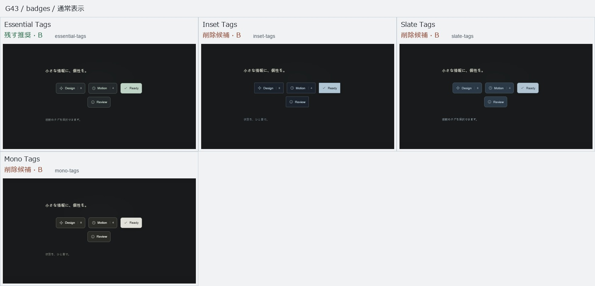

- 似ているところ：小さな長方形チップを並べ、選択面を反転する。
- 異なるところ：配色と角丸。初期の表示専用・選択設定も違う。
- 残す：Essential Tags (essential-tags)
- 削除候補：Inset Tags (inset-tags)、Slate Tags (slate-tags)、Mono Tags (mono-tags)
- 理由：表示専用・選択・削除は共通オプションで変更可能。独立パーツの差は小さい。

### G44 数値入力 / 優先度高

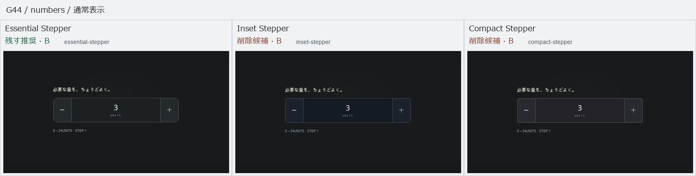

- 似ているところ：左に減算、中央に直接入力、右に加算。
- 異なるところ：色と数pxの字体・境界の差。
- 残す：Essential Stepper (essential-stepper)
- 削除候補：Inset Stepper (inset-stepper)、Compact Stepper (compact-stepper)
- 理由：同じ数値編集の構造。独立した調整機構や配置差がない。

### G45 数値入力 / 優先度高

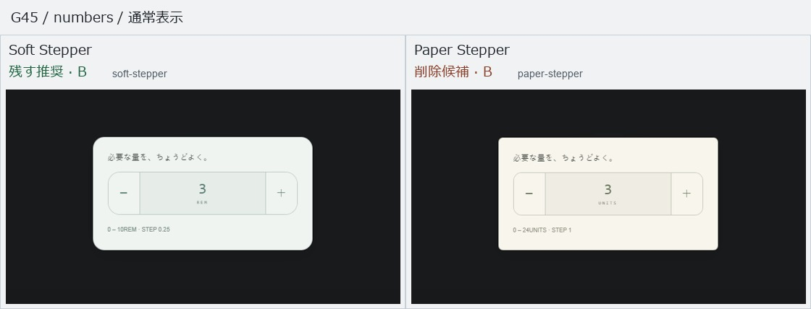

- 似ているところ：明るい外枠の三分割数値入力。
- 異なるところ：初期の単位・刻み、色温度・角丸・字体。
- 残す：Soft Stepper (soft-stepper)
- 削除候補：Paper Stepper (paper-stepper)
- 理由：小数や刻みは共通APIの設定で変更できる。明色版を代表1件にする。

### G46 色選択 / 優先度中

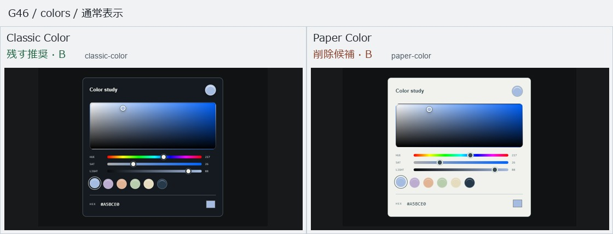

- 似ているところ：矩形の色面、HSV調整、色見本、HEX欄。
- 異なるところ：白い外枠と字体、スライダーの色。
- 残す：Classic Color (classic-color)
- 削除候補：Paper Color (paper-color)
- 理由：色選択の操作と構成が同じ。Paperは明色テーマとして扱える。

### G47 スケルトン / 優先度中

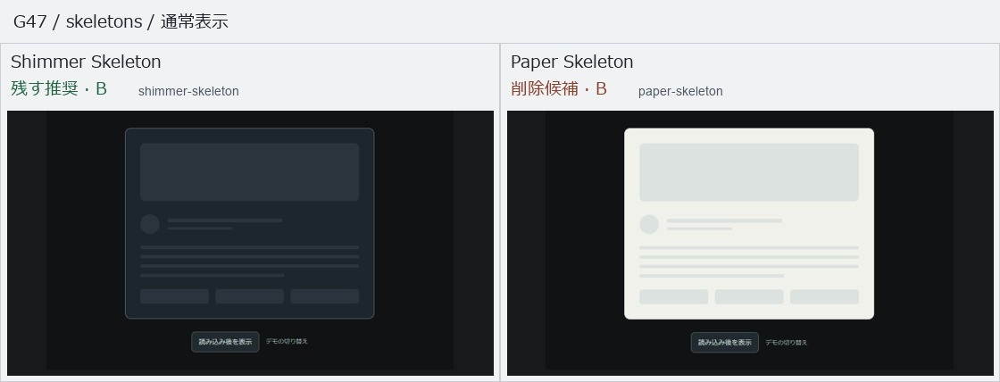

- 似ているところ：画像・プロフィール・文章・操作を同じ場所で仮表示する。
- 異なるところ：紙色の背景と仮表示面の色。
- 残す：Shimmer Skeleton (shimmer-skeleton)
- 削除候補：Paper Skeleton (paper-skeleton)
- 理由：同じ骨格と読み込み表示。文章・表・プロフィール専用の骨格は残す。

### G48 タイムライン / 優先度中

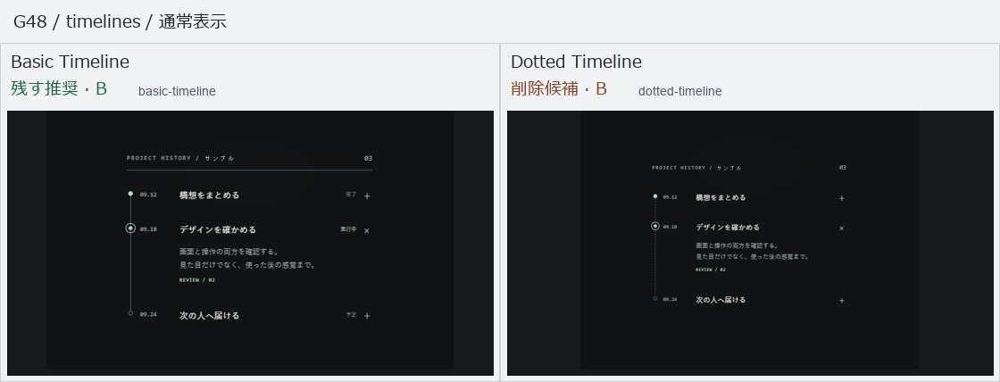

- 似ているところ：日付、縦線、点、開閉できる履歴を縦に配置。
- 異なるところ：線の点線化とステータス表示の微差。
- 残す：Basic Timeline (basic-timeline)
- 削除候補：Dotted Timeline (dotted-timeline)
- 理由：履歴の配置と開閉は同じ。線種はBasicの設定として扱える。

### G49 検索バー / 優先度高

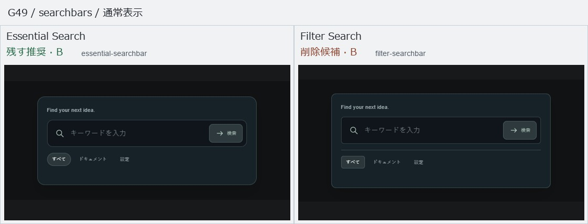

- 似ているところ：検索欄と送信ボタン、その下に3つのフィルター。
- 異なるところ：Filterはフィルター上に区切り線を加える。
- 残す：Essential Search (essential-searchbar)
- 削除候補：Filter Search (filter-searchbar)
- 理由：Essentialにもフィルターがあり、Filter固有の機能・構成差がほぼない。

### G50 検索バー / 優先度高

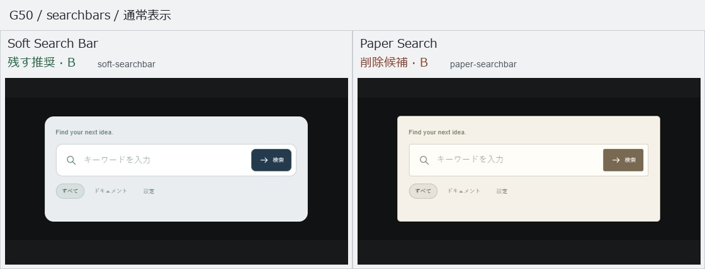

- 似ているところ：明るい外枠、検索欄、送信、フィルター。
- 異なるところ：色温度・角丸・字体。
- 残す：Soft Search Bar (soft-searchbar)
- 削除候補：Paper Search (paper-searchbar)
- 理由：検索結果の構成も同じ。明色の代表に集約できる。

### G51 コマンド / 優先度高

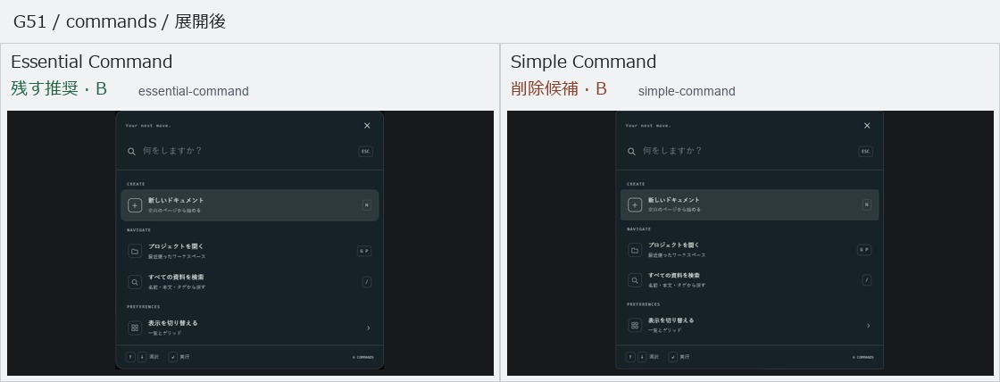

- 似ているところ：コマンド記号・見出し・検索欄を同じ順で配置。
- 異なるところ：Simpleは枠の角を少し鋭くする。
- 残す：Essential Command (essential-command)
- 削除候補：Simple Command (simple-command)
- 理由：開いたコマンド一覧も同じ構造。Simpleの独立した用途が弱い。

### G52 コマンド / 優先度中

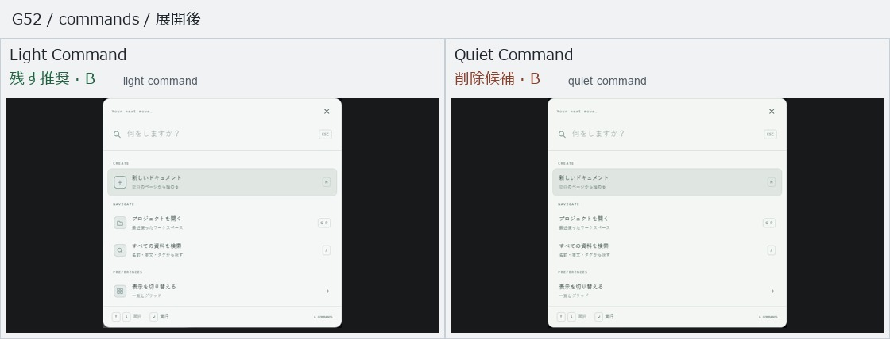

- 似ているところ：白い外枠と同じコマンド検索・一覧。
- 異なるところ：Quietは一覧のアイコンを省く。Lightはアイコン付き。外枠の色温度・角丸も違う。
- 残す：Light Command (light-command)
- 削除候補：Quiet Command (quiet-command)
- 理由：検索・グループ・候補行の構成は重なる。アイコン省略を独立したデザインとして残す方針なら保留。整理するなら情報の識別がしやすいLightを残す。

### G53 コンテキストメニュー / 優先度中

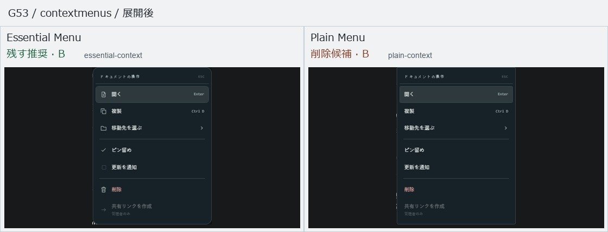

- 似ているところ：ファイル記号・2行の説明・右端のメニューボタン。
- 異なるところ：Plainはメニューのアイコンを省き、角丸を小さくする。Essentialはアイコン付き。
- 残す：Essential Menu (essential-context)
- 削除候補：Plain Menu (plain-context)
- 理由：同じ操作一覧を簡略化した形。文字だけのメニューに独立した価値を置くなら保留。整理するなら項目の識別がしやすいEssentialを残す。

### G54 コンテキストメニュー / 優先度高

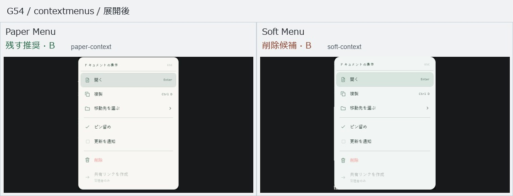

- 似ているところ：明るい面と同じファイル操作メニュー。
- 異なるところ：色温度・角丸・記号の背景。
- 残す：Paper Menu (paper-context)
- 削除候補：Soft Menu (soft-context)
- 理由：展開時にも配置が重なる。Paperを明色の基本形にする。

### G55 ナビゲーション / 優先度中

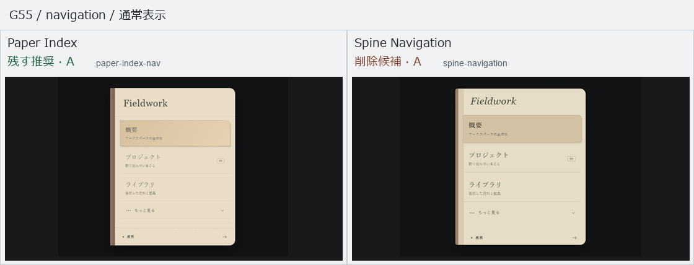

- 似ているところ：本のような紙色の縦ナビと左の綴じ目。
- 異なるところ：Spineは角が丸く、本文の字体と背の陰影が違う。
- 残す：Paper Index (paper-index-nav)
- 削除候補：Spine Navigation (spine-navigation)
- 理由：選択・展開時も紙の縦索引として重なる。Paper Indexの明確な綴じ目を残す。

### G56 テーブル / 優先度中

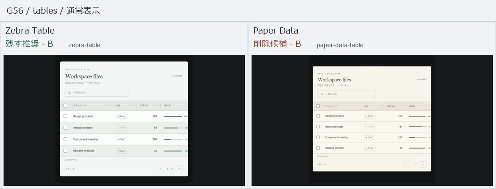

- 似ているところ：明るい表、検索、選択、ソート、交互の行背景。
- 異なるところ：白と生成り、見出しの字体と枠の微差。
- 残す：Zebra Table (zebra-table)
- 削除候補：Paper Data (paper-data-table)
- 理由：同じ表構成・操作で、色を変えた表としてまとめられる。

### G57 テーブル / 優先度中

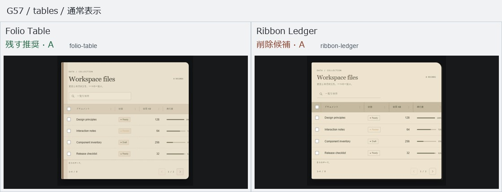

- 似ているところ：紙色の角丸表と左端の綴じ目、同じ行構成。
- 異なるところ：Ribbonの左端の濃い帯と見出しの字体、Folioの重なりの影。
- 残す：Folio Table (folio-table)
- 削除候補：Ribbon Ledger (ribbon-ledger)
- 理由：表の見せ方が近く、リボンが操作機構になるわけでもない。Folioの紙層を代表にする。

### G58 装飾 / 優先度中

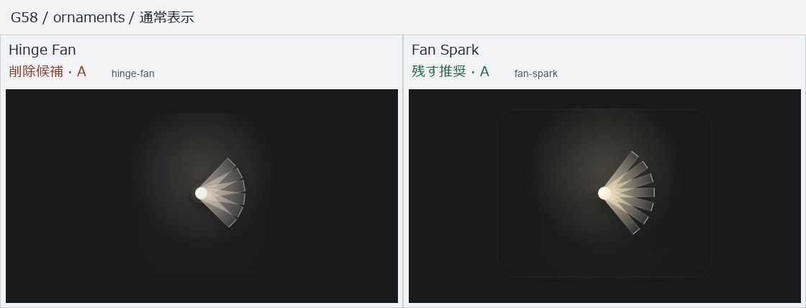

- 似ているところ：一点を軸に、金色の細い羽根を扇状に展開する装飾。
- 異なるところ：Hingeはゆっくり漂う。Fan Sparkはホバーで扇を大きく開く。
- 残す：Fan Spark (fan-spark)
- 削除候補：Hinge Fan (hinge-fan)
- 理由：差はあるが、同じ扇の枠が重なる。Aの操作反応を重視してFan Sparkを残す。

### G59 ドロップダウン / 優先度中

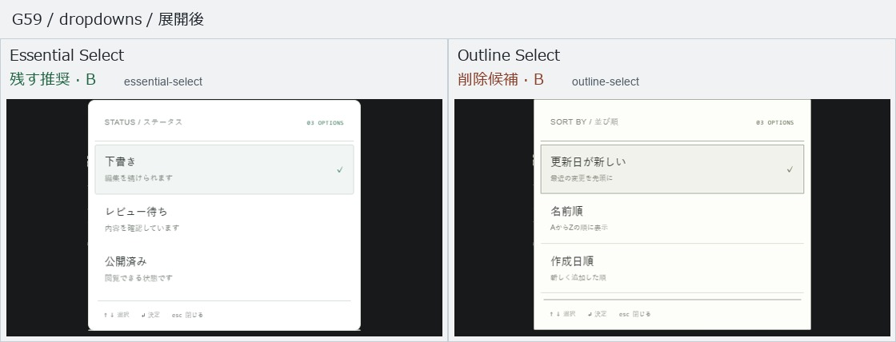

- 似ているところ：明るいメニューに、項目名・説明・右端チェック・上下の区切りを並べる。
- 異なるところ：Outlineは角を鋭くし、項目ごとの下線を強める。Essentialは角丸と弱い影。
- 残す：Essential Select (essential-select)
- 削除候補：Outline Select (outline-select)
- 理由：展開後の情報構成と選択動作がほぼ同じ。輪郭の強さを別パーツとして残す価値より、基本形を集約する方針ならOutlineを外す。

### G60 ドロップダウン / 優先度中

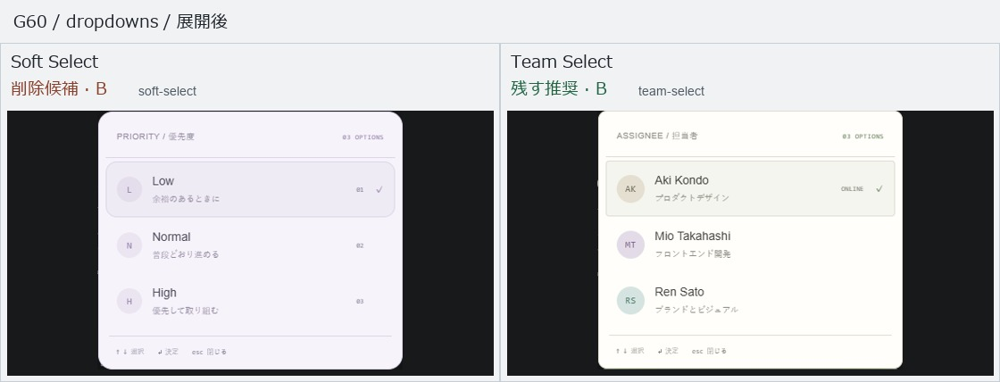

- 似ているところ：丸いイニシャル表示、項目名・説明・右端情報を持つ明るいメニュー。
- 異なるところ：Softは紫と大きい角丸。Teamは生成りと項目別のイニシャル色。
- 残す：Team Select (team-select)
- 削除候補：Soft Select (soft-select)
- 理由：用途名は違うが、表示構造は同じ。イニシャルの識別が明確なTeamを残し、紫色は配色展開としてまとめる案。

### G61 ドロップダウン / 優先度中

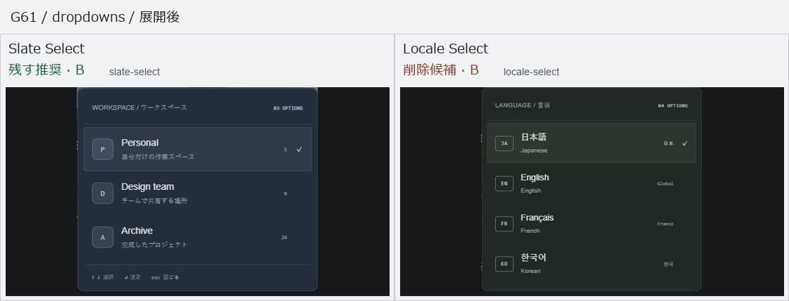

- 似ているところ：暗いメニューに、角型の短い記号、項目名・説明・右端情報を置く。
- 異なるところ：Slateは青灰と四角い記号。Localeは緑黒と横長の言語コード。
- 残す：Slate Select (slate-select)
- 削除候補：Locale Select (locale-select)
- 理由：専用機能の差より項目データと配色の差が大きい。Localeのコード表示を設定として引き継ぐ前提でSlateへまとめる。

## 確認範囲

|カテゴリ|調査件数|類似組|削除候補|
|---|---:|---:|---:|
|トグル|24|0|0|
|カード|24|2|2|
|スクロールバー|36|2|3|
|ドロップダウン|36|3|3|
|アコーディオン|24|0|0|
|テキスト入力|24|0|0|
|ボタン|24|1|2|
|リンク|16|1|1|
|タブ|24|2|2|
|セグメント|24|4|6|
|チェックボックス|24|1|2|
|ダイアログ|24|2|2|
|スライダー|24|3|4|
|ラジオ|24|2|3|
|コンボボックス|24|3|4|
|通知|24|2|5|
|ポップオーバー|24|1|3|
|進捗|24|2|4|
|ローダー|39|7|14|
|アップロード|20|2|4|
|日時入力|20|1|2|
|ページ送り|16|2|3|
|パンくず|16|2|4|
|タグ|24|1|3|
|数値入力|20|2|3|
|アバター|16|0|0|
|評価|16|0|0|
|色選択|16|1|1|
|スケルトン|16|1|1|
|タイムライン|16|1|1|
|ウィザード|16|0|0|
|検索バー|20|2|2|
|コマンド|16|2|2|
|コンテキストメニュー|16|2|2|
|ナビゲーション|20|1|1|
|テーブル|16|2|2|
|装飾|30|1|1|

## 作成物

- `EVIDENCE.md`：共通実装の根拠と、似ていても残した例。
- `verification.json`：写真・絞り込み・オフライン表示の確認結果。
- `index.html`：全候補の並列写真・説明。オフラインでも閲覧可能。
- `README.md`：文書版。
- `comparisons/`：組ごとの並列写真。
- `photos/`：全817パーツの通常写真と操作後写真。
- `sheets/`：全カテゴリA/Bと展開状態の写真一覧。
- `inventory.json`、`findings.json`、`states.json`：根拠データ。
- `tools/`：取得・生成スクリプト。

このフォルダだけを削除すれば、本調査の作成物をまとめて除去できます。アプリのソースには変更を加えていません。
